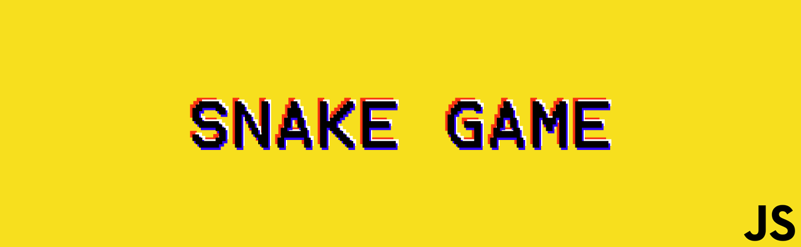

<h1 align="center">
    
</h1>

<p align ="center">
  <a href='https://duarterenan.github.io/snakegame/#'> View Demo</a>
</p>

## 💻 About

The ***Snake Game*** its a classic famous game who first appeared in 1997 on the Nokia 6110, along with the games Logic and Memory.

This project was developed following the videos of ***ProgramadorBR - Igor Oliveira***, on [YouTube](https://youtu.be/Hua1OSXitdQ).

## ⚙️ Features

- [x] Points system.
- [x] Record system:
- [x] Desktop version.
- [ ] Mobile users can play too.
- [ ] Record saves in localstorage browser.
- [ ] Menu screen before game start.
- [ ] Users can set up  the color of the snake and background.

## 🕹️ How to play?

### Commands
For play the game you need to use the arrows of your keyboard

- ←	Arrow Left - Change the direction of snake Left
- ↑	Arrow Up - Change the direction of snake Up
- →	Arrow Right - Change the direction of snake Right
- ↓	Arrow Down - Change the direction of snake Down

**NOTES**
- If you press the opposite direction you are going, you **DIE**.
- You can pass free of the walls. The snake will appear in the other side of the canvas.
- **Enjoy!**

## 🎨 Layout:

### Web

<p align = center>
  
<p>

## Getting Started

For use this, you just need a browser like a Google Chrome (recommended). The alterations will getting saved by user browser local storage.

### Installation

1. Clone the repo
   ```sh
   git clone https://github.com/DuarteRenan/snakegame.git
   ```
 2. Double click on the index.html file.

## 🦸 Author
 [](https://www.linkedin.com/in/renan-duarte-166402141/)
  
## 🛠 Language and Tools:
 <a href="https://www.photoshop.com/en" rel="nofollow">  </a>
   <a href="https://www.w3.org/html/" rel="nofollow">  </a>
   <a href="https://developer.mozilla.org/en-US/docs/Web/JavaScript" rel="nofollow">  </a>
   <a href="https://www.w3schools.com/css/" rel="nofollow">  </a>
   
## 📝 License

This project is under the license [MIT](./LICENSE).

